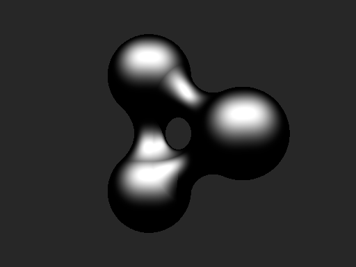

# engcomp-computacao-grafica
Meus arquivos relativos à disciplina Computação Gráfica do curso de Engenharia da Univesp.

## Semana 2
* Exercício 1

## Semana 4
* Exercício 1

- ambient

- diffuse

- specular

- best fit

* Exercício 2

- point

- parallel

- spot

## Créditos

**Exercícios**: [Univesp](http://engenharia.cursos.univesp.br/)

**Respostas**: Ermogenes Palacio - Twitter: [@ermogenes](http://www.twitter.com/ermogenes